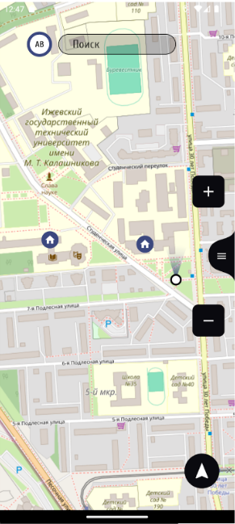
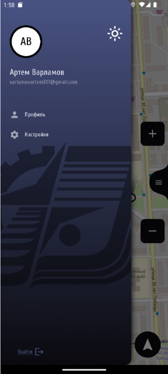
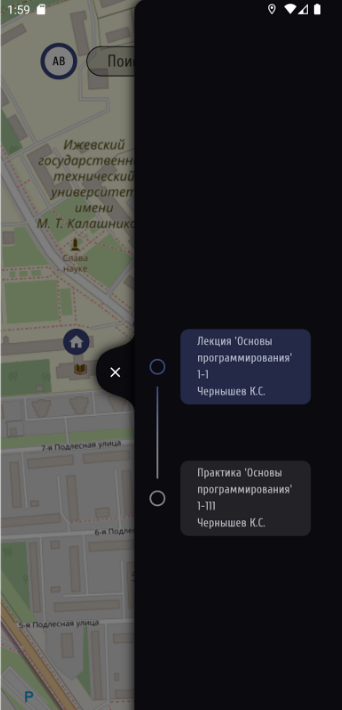
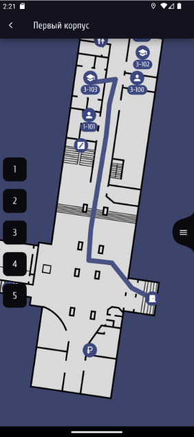

# Навигационный сервис для ИжГТУ

## Описание проекта
Данный проект представляет собой навигационный сервис, разработанный для студентов Ижевского Государственного Технического Университета (ИжГТУ). Основная цель сервиса — упростить процесс поиска аудиторий и других ключевых мест на территории университета. Это особенно важно для первокурсников, которые сталкиваются с трудностями при ориентации на большой территории ИжГТУ, а также для студентов, которым необходимо найти редко посещаемые помещения, такие как кабинеты военного учета или актовые залы.

Кроме того, сервис решает проблему с доступом к расписанию занятий, предоставляя удобный доступ к расписанию через мобильное приложение без необходимости использовать браузер.

### Основные функции:
- Интерактивная карта университета с функцией навигации.
- Поиск аудиторий и других мест по ключевым словам.
- Интеграция с личным кабинетом студента для получения актуальной информации.
- Доступ к расписанию занятий в удобном формате.

